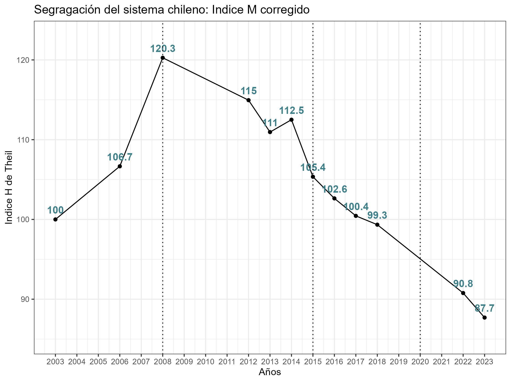

class: inverse, bottom, right

```{r, include=FALSE,echo=FALSE,results='hide'}
#install.packages("pagedown")
#pagedown::chrome_print("segunda_catedra.html",output="segunda_catedra.pdf")
```


```{r setup, include=FALSE, cache = FALSE}

library(dplyr)
require("knitr")
options(htmltools.dir.version = FALSE)
pacman::p_load(RefManageR)
 
```

```{r eval=FALSE, echo=FALSE}
# Correr esta línea para ejecutar
rmarkdown::render('xaringan::moon_reader')
```

<!---
About macros.js: permite escalar las imágenes como [:scale 50%](path to image), hay si que grabar ese archivo js en el directorio.
.pull-left[<images/Conocimiento cívico.png>] 
.pull-right[<images/Conocimiento cívico_graf.png>]

--->

# __¿Es posible revertir la segregación escolar?__
## *El impacto de las políticas integradoras en el caso de Chile*
<br>
<hr>
## Seminario interno IE-CIAE

### Presentador: Francisco Meneses
### Autores: Juan Pablo Valenzuela, Francisco Meneses, Claudio Allende

<br>

---
class: inverse, middle, center, slideInRight

# ¿Qué es la segregación escolar? 
# Impactos de la segregación


---

## La segregación educativa es...

<div style="display:flex; align-items:flex-start; gap:0.5em;">
  
  
  <div>
    <ul style="margin-top:0.5em; line-height:2;">
      <li>La <strong>Agrupación</strong> de estudiantes según su nivel socioeconómico</li>
      <li>La <strong>falta de integración</strong> de estudiantes entre escuelas</li>
      <li><strong>Marginación</strong> de estudiantes según sus características</li>
      <li><em>Cada oveja con su pareja</em></li>
      <li><em>Suele medirse con <strong>El Índice de Duncan</strong> </em></li>
    </ul>
  </div>
</div>
---

class: inverse, middle, center, slideInRight

# ¿Y es importante ese "indicador"?


---

# Inequidad en el efecto par 


* El efecto par implica que los estudiantes aprenden de sus compañeros


* El valor del efecto par: _"la maldición del conocimiento"_

> La segregación impide que los estudiantes más vulnerables aprendan y se motiven junto a sus pares más aventajados [(Reardon & Owens, 2014)](https://doi.org/10.1146/annurev-soc-071913-043152)

<div style="text-align:center;">

  

</div>

---

# Desigualdad en el acceso al mejoramiento educativo


* El mejoramiento escolar es sumamente complejo y difícil de sostener, y un factor clave son liderazgos y los buenos docentes

* la segregación __dificulta la atracción__ y retención de talentos docentes y directivos en sectores marginados [(Rumberger & Palardy, 2005)](https://doi.org/10.1177/016146810510700905) 


<div style="text-align:center;">

  

</div>

---

# Es costoso... 


> 

* Es sumamente costoso compensar las dificultades de escuelas marginadas 

    + La SEP es un intento, positivo, pero monetariamente insuficiente.


* Países con mayores niveles de segregación educativa logran peores resultados educativos

    + _Las ganancias de unos no compensan la perdida de la mayoría_


---

# Afecta nuestra cohesión 

* Dificulta la posibilidad de convivir con otros  

* Afecta las competencias cívicas [(Janmaat, 2011)](https://doi.org/10.1177/0268580910393044)

* Dificulta la tolerancia a la diversidad [(Caro & Schulz 2012)](https://doi.org/10.2304/csee.2012.11.3.21) 


<div style="text-align:center;">

  

</div>
---

class: inverse, middle, center, slideInRight

# ¿Cómo es la segregación en Chile? 
## ¿Qué explica sus niveles de segregación?


---

# La segregación chilena en perspectiva


* En los 2000 Chile tenía un indice de Duncan de 0.6
  
  + Considerado técnicamente como __hiper-segregado__

*  En Chile (2006) vs OCDE:

    + Grupos vulnerables → 33% más segregados

    + Grupos ricos → 42% más segregados


* En comparación con otros países de la región Chile se mantiene en el top de de segregación


<div style="text-align:center;">

  

</div>

---

# ¿Qué ha influido en la segregación chilena?: 

 * La segregación residencial 
 
 * Competencia entre escuelas: estudiantes con buen SIMCE 
 
 * Barreras económicas de entrada
 
 * Decisiones familiares
 
 * Prácticas selectivas:
 
      + Pruebas cognitivas de selección
      
      + Criterios religiosos
      
      + Entrevistas a apoderados y/o estudiantes
      
      
      
      
---

# Políticas asociadas la segregación

 * Orientación de mercado (1980-1990): 
      
      * Privatización 
      * La competencia por Voucher
      * Financiamiento compartido
      

 * La Ley del 15% (2006)

    
 * La Ley SEP - Subvención Escolar Preferencial (2008)
 

 * Ley de Inclusión (2015)
 
    +  Fin al lucro
    
    +  Fin al financiamiento compartido 
    
    +  Fin a la selección - Sistema de admisión escolar SAE 

---

class: inverse, middle, center, slideInRight


# ¿Cuál ha sido el efecto de estas políticas en la disminución de la segregación?

---

# Metodología

* __Datos__:  Utilizamos los datos de NSE del SIMCE (4°B  y II°M)

* __Variables__: 
  
  + _Quintiles de NSE_:  Mediante Análisis Factorial Confirmatorio (AFC) creamos un índice comparable en el tiempo con el cual construimos quintiles socioeconómicos.  
  
  + Segregación: utilizamos el _Índice de entropia de Theil_, mediante el paquete $segregation$ de Rstudio [(Elber, 2023)](https://elbersb.github.io/segregation/articles/segregation.html)


*  __Métodos__: 

    * Análisis descriptivo: Índice M corregido de Theil [(Elber, 2021)](https://journals.sagepub.com/doi/10.1177/0049124121986204)
    
    * Regresiones multinivel de escuelas anidadas en comunas
    
???

El indice de theil es más sensible a cambios que duncan, permite desagregación y permite incluso obtener un valor por colegio

mejor medición de nse, es estable.  (cambia )

Ventajas del theil.  

---
# Medición del NSE  


<div style="text-align:center;">

  

</div>

* Medición comparable en el tiempo (_invarianza longitudinal_ A1)

* Construimos quintiles por año (_Mejor comparabilidad_)


---
class: inverse, middle, center, slideInRight

# Estudio descriptivo 

---

<div style="text-align:center;">

  

</div>


???

*  Fijamos a valor del 2002 como el "100" para hacer una medida comparable.

* La historia de los tres periodos

    + El aumento
    
    + La Meseta
    
    + La Caida
 
* Ahora bien, no sabemos a que se deben estos cambios. LyD lo dijo claramente.  


 }
 
---
class: inverse, middle, center, slideInRight

# Modelamiento multinivel 
 
---

# Explicación del modelo

__Unidad de análisis__: Escuelas agregadas en comunas

__Variable dependiente:__ Contribución de cada escuela a la segregación del país. Mide cuan sub y sobrerrepresentados se encuentra cada uno de los 5 grupos de NSE


__Variables independientes de iteres:__ 

* Años
* Políticas públicas
  + __SEP__ Adscripción de la escuela a la SEP  (Si/No)
  + __SAE__ porcentaje de estudiantes que ingresaron por SAE (%)
  + __Fin copago__ con o sin copago, distinguiendo monto  ($)

__controles:__ segregación territorial, Cantidad de estudiantes

???

SEP:  no todos tienen esta política

SAE algunos venian de antes y otros pasan por alado

Fin al copago: ha sido paulatino. 

---

# Contribución de la escela a la segregación

* La variable fue recodificada para ir de 0 a 100

* __0%__:
    + significa que todos los quintiles están igual de representados (~20% de cada quintil)

* __100%__
    + que la escuela solo tiene estudiantes de un quintil en particular (ej. 100% del Q5)
    
* __Valores Intermedios__:
    + Algunos grupos están sobrerrepresentados y otros subrepresentados.

---

<iframe src="images/model_2m_segregation_dca_0to100.html" width="100%" height="600px" style="border:none;"></iframe>


???

Analisemos por parte  

#  Tendencia historica

* vemos un aumento en el primer periodo que se mantiene significativo hasta 2014

* ahi alcanzamos los niveles del 2001

* Del 2022 se observan cambios significativos 

# Control redicencial

# Efecto de las politicas

# efecto controlado

---

# Resultados en limpio:


 *  Existe una disminución significativa en el aporte a la segregación de cada escuela
 
 *  El cambio en el tiempo no se explica al controlar por la segregación residencial
 
 *  Sobre las políticas:
      
      + Una escuela adscrita a la SEP tiene 2% menos de segregación
      
      + Por cada quinto adicional de estudiantes SAE la segregación baja 3% 
      
      + Escuelas gratuitas son más inclusivas que las que cobran más de 50k, pero más segregadas que las que cobran menos de 50k

---

# En síntesis  


* Hay pocos ejemplos en el mundo de desegregación, pero Chile logró revertir la tendencia  (2002-2008).

* La Ley SEP (2008) puso fin a la tendencia al aumento en la segregación escolar en Chile.

* La Ley de Inclusión (2015) ha permitido un segundo impulso hacia la integración.

* Los valores de segregación aún son altos

* La disminución de la segregación se explica más por las políticas que por cambios demográficos


---

# Discusión 

 * Existen varios estudios sobre este tema y suelen no encontrar efectos. 
 
      + En general utilizan datos hasta antes del 2020 
      
      + También utilizan indicadores menos sensibles a los cambios como Duncan 
      
      + Suelen utilizan medidas poco estables de NSE 
      
 
 * Ahora la segregación es ENTRE dependencias  ¿qué hacer? 
 
 * Es importante seguir estudiando la temática
    
     + Efectos de la inclusión: aprendizaje, brechas y convivencia
      
      
  

---

class: inverse, middle, center, slideInRight

# Anexos

---

# Anexo 1 

.small[

**Tabla 1: Evidencia de invarianza longitudinal, ajustes y diferencias en los ajustes - cuarto grado**

| Modelo                | n      | χ2 (gl)   | p-value (χ2) | RMSEA | CFI  | Δχ2        | ΔRMSEA | ΔCFI  |
|------------------------|--------|-----------|--------------|-------|------|------------|--------|-------|
| Invarianza (agrupada) | 350339 | 1949 (22) | <0.001       | 0.021 | 0.999| -          | -      | -     |
| Invarianza escalar     | 350339 | 1949 (44) | <0.001       | 0.015 | 0.999| <0.01      | 0.006  | <0.001|
| Invarianza estricta    | 350339 | 10103 (77)| <0.001       | 0.026 | 0.996| 8154.1***  | 0.011  | 0.003 |


]

---


